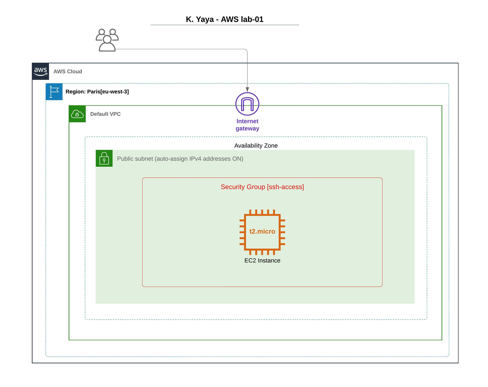

# terraform aws lab-01

## Architecture


## Requirements

### Having Terraform installed / Install Terraform
- Install Terraform from https://developer.hashicorp.com/terraform/install

- Test Installation
```shell
terraform --version
```

### Having AWS CLI installed / Install AWS CLI
- Configure AWS CLI
```shell
aws configure
```
1. Set Your Access Key ID
2. Set Secret Access Key
3. Set the default region : eu-west-3 (We will use Paris for this lab)
4. Output format : json

- Test Config
```shell
aws ec2 describe-vpcs --region eu-west-3
```

## Deployment

```shell
terraform init
```

```shell
terraform plan
```

```shell
terraform apply
```
confirm by tapping yes

## Testing
```shell
ssh -i ~/.ssh/tf-aws-lab-01.pem ec2-user@<PUBLIC_IP>
```

## Destruction

```shell
terraform destroy
```
confirm by tapping yes

## Work In progress...
create file main.tf with the same content with repository file
generating ssh key 
```shell
ssh-keygen -t rsa -b 2048 -f ~/.ssh/tf-aws-lab-01 -C "tf-aws-lab-01" -N ""
```
