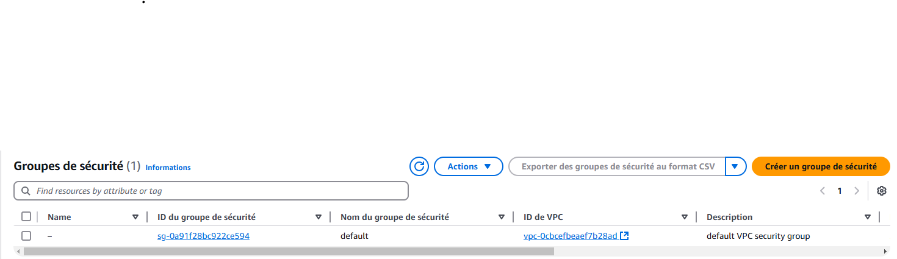

# terraform aws lab-01

## Architecture


## Requirements

### Having Terraform installed / Install Terraform
- Install Terraform from https://developer.hashicorp.com/terraform/install

- Test Installation
```shell
terraform --version
```


### Having AWS CLI installed / Install AWS CLI
- Configure AWS CLI
```shell
aws configure
```
1. Set Your Access Key ID
2. Set Secret Access Key
3. Set the default region : eu-west-3 (We will use Paris for this lab)
4. Output format : json


- Test Config
```shell
aws ec2 describe-vpcs --region eu-west-3
```


## Deployment
Create a main.tf file with the same contents as the one in the repository


Generate a ssh key for having access to your ec2 instance
```shell
ssh-keygen -t rsa -b 2048 -f ~/.ssh/tf-aws-lab-01 -C "tf-aws-lab-01" -N ""
```


Checking before deployment(there is no ec2 instance or security group):



Initialize the project
```shell
terraform init
```


Plan deployment
```shell
terraform plan
```


Apply deployment
```shell
terraform apply
```

confirm by tapping yes


Checking after deployment(there is no ec2 instance or security group):


## Testing
Connect to our created ec2 instance
```shell
ssh -i ~/.ssh/tf-aws-lab-01.pem ec2-user@<PUBLIC_IP>
```


## Destruction
Destroy our infrastructure
```shell
terraform destroy
```


confirm by tapping yes


Checking after destruction(there is no ec2 instance or security group):


